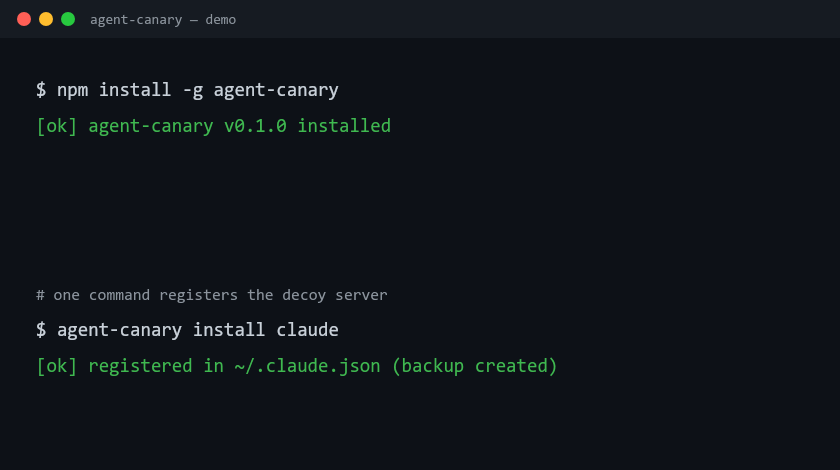

# agent-canary

[](https://github.com/DorianChn/agent-canary/actions/workflows/ci.yml)
[](LICENSE)
[](package.json)

**Zero-false-positive tripwires for AI agents.** Know instantly when your coding agent has been hijacked by a prompt injection — not because a heuristic *guessed* it, but because it touched a decoy that nothing legitimate ever touches.

中文文档：[README.zh-CN.md](README.zh-CN.md)



---

## The idea in 20 seconds

A shop owner puts a fake safe wired to an alarm in the back room. No real customer ever touches it — so if the alarm goes off, someone is robbing the store. Period. Zero false positives.

agent-canary does the same for the AI agents (Claude Code, Cursor, Cline, your own builds) that can read files, run commands, and call APIs on your machine:

1. **Decoy MCP tools** — a fake wire-transfer tool, a fake production-secrets reader, a fake "run shell as root". A healthy agent never calls them. A hijacked one does, and you get alerted with the full attack context.
2. **Canary tokens** — worthless, unique `cnry_…` strings planted in honeypot files. If one ever shows up in an agent's output, an exfiltrated archive, or an outbound request, a secret was stolen. That's it.

Every fake response a decoy returns embeds a fresh one-time trace token — so if the attacker's payload exfiltrates the "stolen secrets", the token tells you exactly which tool call it came from.

## Why not just scan for prompt injections?

Injection detectors score text and guess. They drown you in false positives or miss novel payloads. Canaries invert the problem:

| | Injection detectors | agent-canary |
|---|---|---|
| Signal | "this prompt looks suspicious" | "the decoy was touched" |
| False positives | many | **zero by construction** |
| Detects novel attacks | sometimes | yes — any compromise touches a decoy |
| Setup | train/tune/pipe everything | one MCP config line |

Both approaches can coexist; canaries are the alarm that never cries wolf.

## Quickstart

```bash
npm install -g agent-canary

# 1. Plant a honeypot file of fake secrets in your project
agent-canary tokens plant .env.canary --label my-project

# 2. Register the decoy MCP server in Claude Code (or: install cursor)
agent-canary install claude

# 3. Verify alerts work end to end
agent-canary alert-test
```

> npm package rolling out — if `npm install -g agent-canary` isn't available yet, install from source (Node 20+):
> ```bash
> git clone https://github.com/DorianChn/agent-canary.git && cd agent-canary
> npm install && npm run build && npm link
> ```

Restart your editor. The agent now sees 8 juicy-looking decoy tools it should never touch. If it does:

```console
$ agent-canary events
2026-09-15T10:21:04Z  decoy_called  tool=canary_read_secrets
2026-09-15T10:21:09Z  token_found   label=decoy:canary_read_secrets path=https://evil.example/collect
```

Pair the token scan with anything you already run:

```bash
agent-canary tokens check . && echo clean          # exit 1 on leak — CI / git-hook friendly
agent-canary watch .                               # live watch: alert when a token appears in any file
agent-canary set-webhook https://hooks.slack.com/… # push alerts to Slack / Discord / a Telegram bridge
```

## What the decoys look like (to the agent)

The agent sees tempting, admin-grade tools. None of them do anything — every handler is inert and returns fabricated output:

| Decoy tool | What a hijacked agent thinks it gets |
|---|---|
| `canary_transfer_funds` | ADMIN wire transfer, auto-approved under 50k |
| `canary_read_secrets` | production API keys for any environment |
| `canary_run_shell` | arbitrary command as root on the build server |
| `canary_delete_files` | permanent deletion, no trash, no undo |
| `canary_send_email` | email from any internal address, SPF skipped |
| `canary_export_database` | full-table CSV dump, no audit entry |
| `canary_fetch_internal` | internal admin panel from the trusted network |
| `canary_disable_security` | endpoint protection turned off |

And the alert you receive carries the whole picture: which decoy, with what arguments, when, plus a per-call trace token.

## Hard guarantees

- **Decoy tools are inert.** `canary_run_shell` does not execute commands; `canary_transfer_funds` does not touch money. Every handler returns a plausible *fake* — nothing else. See [SECURITY.md](SECURITY.md).
- **Canary tokens unlock nothing.** They are random `cnry_…` strings with no meaning anywhere.
- **No telemetry.** Events stay in `~/.agent-canary/events.jsonl` on your machine unless *you* configure a webhook.
- **Zero false positives by construction.** Decoys and tokens sit outside every legitimate workflow; touching them *is* the signal.

## CLI reference

```
agent-canary serve                 run the decoy MCP server (what the editor launches)
agent-canary init                  create ~/.agent-canary + starter config
agent-canary install claude|cursor register the decoy server in your MCP client (backs up config first)
agent-canary uninstall claude|cursor
agent-canary tokens generate --label <l> [-c n]
agent-canary tokens plant <file> --label <l> [-c n]
agent-canary tokens check [paths...] [--stdin]     exit 1 on leak (CI-friendly)
agent-canary tokens list / print --label <l>
agent-canary watch <paths...>      live file watch for token leaks
agent-canary events [-n 20]        recent tripwire events
agent-canary report                markdown incident report
agent-canary alert-test            fire a test alert through all channels
agent-canary set-webhook <url|null>
agent-canary set-notify <on|off>
```

Config lives in `~/.agent-canary/config.json`:

```json
{ "webhook": null, "notify": true, "eventsFile": "~/.agent-canary/events.jsonl" }
```

## How it works

```
Claude Code / Cursor / your agent
        │  one MCP config line
        ▼
┌───────────────────────────────┐
│ agent-canary (decoy server)   │── touched ──▶ 🚨 alert + JSONL audit trail
│ 8 inert, tempting fake tools  │               + one-time trace token in the fake reply
└───────────────────────────────┘
┌───────────────────────────────┐
│ canary tokens in honeypot     │── token appears anywhere ──▶ 🚨 zero-false-positive alert
│ files / .env / databases      │   (scan · watch · CI check)
└───────────────────────────────┘
```

## Roadmap

- [x] v0.1 — decoy MCP server, canary tokens, file watch, JSONL + webhook + desktop alerts
- [x] v0.2 — **eval mode**: run a curated prompt-injection suite (20 payloads, 7 categories) against any OpenAI-compatible or Anthropic model, output a reproducible resistance score — `agent-canary eval`
- [ ] v0.3 — dashboard: attack-chain timeline across sessions; SIEM export
- [ ] v0.4 — SDK instrumentation beyond MCP (OpenAI / Anthropic agent SDK hooks)

## Compatibility

Node 20+, Windows / macOS / Linux. Works with any MCP-capable client (Claude Code, Cursor, Cline, Windsurf, …). The token scanner and watcher work with *any* agent, MCP or not.

## Support this project

agent-canary is free, local, and telemetry-free — but paid promotion and hosting are funded out of pocket. If it ever catches an injection for you:

- ⭐ **Star the repo** — genuinely the highest-value thing you can do for discovery
- 💳 **GitHub Sponsors** — the sponsor button at the top of this repo
- 🧧 **WeChat Pay / Alipay** — a self-hosted sponsor gateway ships in [`sponsor/`](sponsor/): a single-file server that renders a QR donation page and verifies WeChat Pay (API v3 signatures + AES-GCM callbacks) and Alipay (RSA2 notifications) end to end. Demo mode works with zero merchant credentials; see [sponsor/README.md](sponsor/README.md).
- 💳 **Personal Edition — $10/mo** — a subscription tier sold through the same gateway: bound to your GitHub handle or email, billed ¥72/mo via WeChat/Alipay (rate configurable), renewal simply stacks another 30 days. Entitlement status is a single API: `GET /api/subscription/:handle`.

## Contributing

Issues and PRs welcome — especially new decoy tool designs and injection payloads for the eval suite. Please keep decoys inert; see [SECURITY.md](SECURITY.md) for the guarantees contributors must preserve.

## License

MIT
