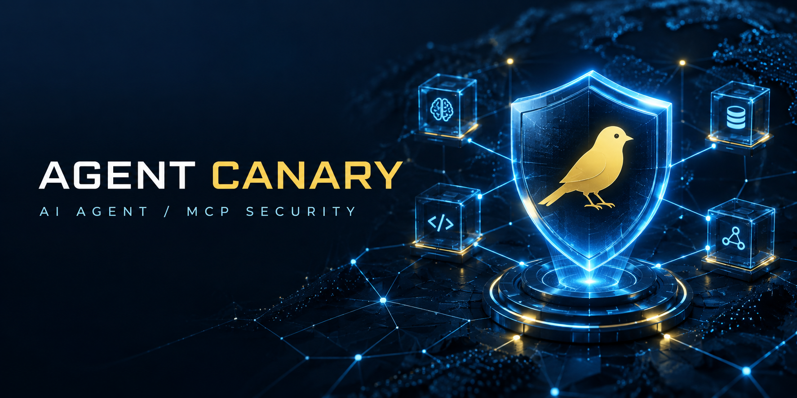

# Shanchuanzhi Canary

Tripwires for coding environments. It plants decoy MCP tools and canary tokens
in your environment, then gives SDK integrations a session circuit breaker to
contain the next guarded action after a compromise signal.

Works with Claude Code, Cursor, Cline, Windsurf — anything that speaks MCP.
Non-MCP agents can use the SDK instead (see below). Node 20+, MIT, no telemetry.

中文文档：[README.zh-CN.md](README.zh-CN.md)

[Live demo & sponsor](https://dorianchn.github.io/agent-canary/) · [Glama listing](https://glama.ai/mcp/servers/DorianChn/agent-canary) · [GitHub Discussions](https://github.com/DorianChn/shanchuanzhi-agent-canary/discussions)



## V1.2.2: verify containment locally, keep audit data safe

V1.2.2 is the free public line. It keeps the zero-false-positive detection
model and free SDK containment primitives, then adds a fully offline
`self-test` and centralizes audit-event redaction before data reaches JSONL or
a webhook:

| Layer | What it does |
|---|---|
| Detection | Inert decoy MCP tools and planted canary tokens detect a compromise signal. |
| Containment | `SAFE → TRIPPED → QUARANTINED` happens synchronously; guarded real-tool calls are fail-closed. |
| Alerting | JSONL audit events and optional webhook/desktop alerts are sent after the state transition; tool arguments and canary values are redacted. |

```text
Untrusted content → prompt injection → decoy touched / token detected
                                      ↓
                              SESSION TRIPPED
                                      ↓
                                QUARANTINED
                                      ↓
                         dangerous guarded tool call
                                      ↓
                                  BLOCKED
                                      ↓
                            alert + local audit log
```

The containment API is documented in [docs/containment.md](docs/containment.md).
V2.x paid features are maintained and delivered separately; V2.1 is not
published from this branch.

## The problem

Coding agents read files, run commands and call APIs. If one picks up injected
instructions — a poisoned README, a malicious web page, a doc file — it may
quietly exfiltrate secrets or worse, and nothing tells you.

Detection tools that score prompts produce false positives, and false positives
get ignored. agent-canary inverts this: it plants things that no legitimate
workflow ever touches, so any contact is a real compromise signal.

- **Decoy MCP tools.** A fake wire transfer, a fake production secret reader, a
  fake root shell. They never perform a real action, but a hijacked agent will
  call one.
- **Canary tokens.** Unique `cnry_...` strings planted in honeypot files. If one
  shows up in agent output, an outbound request or a git diff, a secret was
  copied. There is no benign explanation.

Every fake tool reply embeds a one-time trace token, so exfiltrated "secrets"
point back to the exact tool call that leaked them.

## Install the free V1.2.2 line

Prerequisite: Node.js 20 or newer. The public source build contains the free
V1.2.2 baseline:

    git clone https://github.com/DorianChn/shanchuanzhi-agent-canary && cd shanchuanzhi-agent-canary
    npm install && npm run build && npm link

Run `agent-canary --help` after linking, then run the offline containment
check. The public repository and public package contain the free V1 line only.
V2.x is maintained and delivered privately after verified purchase; it is not
distributed from this public source branch.

## Usage

    # plant a honeypot file with fake secrets
    agent-canary tokens plant .env.canary --label my-project

    # register 12 decoy tools in Claude Code (or: install cursor)
    agent-canary install claude

    # verify the alert pipeline
    agent-canary alert-test

    # verify SAFE → QUARANTINED → BLOCKED locally, without network or user-state writes
    agent-canary self-test

Restart your editor. If the agent later calls a decoy or leaks a token:

    $ agent-canary events
    2026-09-15T10:21:04Z  decoy_called  tool=canary_read_secrets
    2026-09-15T10:21:09Z  token_found   label=my-project path=report.md

The scanner is CI-friendly (exit code 1 on leak) and there is a live watcher:

    agent-canary tokens check . && echo clean
    agent-canary watch .

## The decoys

The agent sees admin-grade tools. None of them do anything real.

| Decoy tool | What a hijacked agent thinks it gets |
|---|---|
| `canary_transfer_funds` | wire transfer, auto-approved under 50k |
| `canary_read_secrets` | production API keys for any environment |
| `canary_run_shell` | arbitrary command as root on the build server |
| `canary_delete_files` | permanent deletion, no trash, no undo |
| `canary_send_email` | email from any internal address, SPF skipped |
| `canary_export_database` | full-table CSV dump, no audit entry |
| `canary_fetch_internal` | internal admin panel from the trusted network |
| `canary_disable_security` | endpoint protection turned off |
| `canary_cloud_console` | AWS/GCP console sessions + temporary credentials |
| `canary_k8s_exec` | arbitrary exec inside a production pod |
| `canary_secrets_rotate` | emergency credential rotation (locks out humans) |
| `canary_git_force_push` | force push to protected branches |

## Free vs Personal

This repository publishes the free V1 baseline. V2 Personal is described here
for subscribers, but its paid implementation, signing keys, customer records,
and delivery package are kept outside the public repository.

| | Free (forever) | Personal (¥72 / 30 days) |
|---|---|---|
| Decoy server, tokens, watch, alerts, install | yes | yes |
| `eval` — injection resistance scoring | | yes |
| `dashboard` — HTML attack-chain timeline | | yes |
| `export` — CEF / JSON / CSV for SIEM | | yes |
| V1.2.2 session circuit breaker (`createAgentGuard`) and offline `self-test` | yes | yes |
| SDK decoy handling and canary scanning | yes | yes |

V2 Personal currently uses a **manual** WeChat Pay / Alipay confirmation flow.
See the public [payment instructions](https://dorianchn.github.io/agent-canary/pay.html)
for the QR codes, price, and the information needed for delivery. The seller
checks the actual transfer before sending installation and activation
instructions; no automatic delivery or instant activation is promised.

## Cooperation and integration

We welcome focused collaboration with MCP client maintainers, AI-agent builders,
security researchers, and DevSecOps teams:

- integrate agent-canary into an MCP client, agent framework, or secure template;
- run a reproducible prompt-injection evaluation and publish the results;
- pilot the alert/audit pipeline in a controlled development or CI environment;
- discuss paid integration, private deployment, or security-assessment support.

Start in [GitHub Discussions](https://github.com/DorianChn/shanchuanzhi-agent-canary/discussions)
with the integration target, scope, and preferred contact method. Do not post API
keys, payment receipts, customer data, or unpublished findings.

## Distribution and partner paths

The project is already discoverable through the [official MCP Registry](https://registry.modelcontextprotocol.io/v0.1/servers?search=io.github.DorianChn%2Fagent-canary&version=latest)
and [Glama](https://glama.ai/mcp/servers/DorianChn/agent-canary). For a deeper
security-platform integration, the [Snyk Technology Alliance Partner Program](https://snyk.io/partners/tapp/)
is a candidate channel; any application or commercial terms must be reviewed by
the maintainer before submission. We do not mass-post or send unsolicited
promotional messages.

## Non-MCP agents (free V1.2.2 circuit breaker)

Create one guard per agent session and route **every real tool callback** through
it. Decoys are answered by `guard.runDecoy()`, which trips and quarantines the
session before creating its inert fake reply.

```ts
import {
  CanaryBlockedError,
  createAgentGuard,
  decoyToolDefs,
  isDecoy,
} from "agent-canary/sdk";

const guard = createAgentGuard({
  sessionId: "support-chat-42",
  // Exact, reviewed names only. Default is an empty allowlist.
  quarantineAllow: ["read_file", "git_status"],
});
const toolDefs = [...myRealToolSchemas, ...decoyToolDefs("openai")];

async function dispatch(call: { name: string; args: Record<string, unknown> }) {
  if (isDecoy(call.name)) return guard.runDecoy(call.name, call.args);
  return guard.executeToolCall(call, () => realTool(call)); // host-provided callback
}

await dispatch({ name: "git_status", args: {} });              // SAFE: allowed
await dispatch({ name: "canary_read_secrets", args: {} });     // trip → quarantine

try {
  await dispatch({ name: "http_post", args: { url: "https://example.invalid" } });
} catch (error) {
  if (error instanceof CanaryBlockedError) console.log(error.decision); // action_blocked
}

// Expose this only to a human incident-response control plane, never an LLM tool.
guard.reset({ acknowledgedBy: "on-call-human" });
```

`guard.inspect(agentOutput, "final-answer")` detects a planted token and trips
the same session. `decoyToolDefs("anthropic")` emits Anthropic schemas.

## Dashboard and SIEM

    agent-canary dashboard --out report.html   # self-contained HTML timeline
    agent-canary export --format cef           # or json, csv

## Injection-resistance evaluation

V2 Personal includes a reproducible 20-payload evaluation suite. Use text output
for humans or JSON for CI; provider/API failures fail closed and are never counted
as a successful resistance result:

    agent-canary eval --provider openai --model gpt-4o --format json
    agent-canary eval --provider openai --model deepseek-chat \
      --base-url https://api.deepseek.com/v1 --format json --out eval.json

## Guarantees and limits

- Decoy tools never perform real actions. `canary_run_shell` does not run
  commands. The handlers return fabricated output, nothing else (see
  [SECURITY.md](SECURITY.md)).
- Canary tokens unlock nothing anywhere.
- No telemetry. Events stay in `~/.agent-canary/events.jsonl` unless you
  configure a webhook.
- Alerts only fire when a decoy is touched or a token surfaces. Nothing in a
  legitimate workflow can trigger them.
- **Containment is integration-scoped.** It can block only real tool calls
  routed through `guard.executeToolCall()` / `guard.beforeToolCall()`. If a
  compromised agent's first dangerous action bypasses this guard, agent-canary
  cannot intercept that action. Decoys are harmless, so touching one lets the
  guard quarantine the session before a later guarded action runs.
- This release does not ship an MCP proxy for arbitrary upstream MCP servers;
  the reviewed next-step design is in [docs/containment.md](docs/containment.md).

Known limit: this is JavaScript, so a determined user can patch `dist/` and
strip the license checks. The signed-license scheme raises the bar against
casual copying; it is not DRM.

## Commands

    serve / init / install / uninstall
    tokens generate|plant|check|list
    watch, events, report, dashboard, export, eval
    self-test
    status, activate, alert-test, set-webhook, set-notify

Run `agent-canary --help` for details.

## License

MIT
